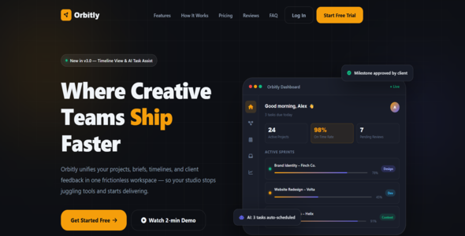

# Orbitly

Orbitly is a premium dark-mode landing page template built with pure HTML, CSS, and JavaScript. It is optimized for SaaS, creative agencies, and product teams who want a polished marketing landing page without a build step.

## Live Demo

https://snehavish595.github.io/orbitly-saas-landing-page/

## Screenshots



## Features

- Dark-mode-first responsive landing page
- No build tools or dependencies required
- CSS custom properties for easy rebranding
- Scroll-triggered animations using IntersectionObserver
- Pricing toggle for monthly and annual plans
- Animated counters, FAQ accordion, and logo marquee
- Sticky glassmorphism navbar and mobile hamburger menu
- Email CTA validation and scroll-to-top button

## File structure

- `index.html` — main landing page
- `documentation.html` — user guide with customization instructions
- `assets/css/style.css` — page styles and design tokens
- `assets/js/main.js` — interactive page behavior
- `screenshots/01_mainpreview.png` — main preview image

## Quick start

### Option A — Open directly

Open `index.html` in a modern browser.

### Option B — Local server

Use any static server for a smoother preview.

```bash
npx serve .
python -m http.server 8080
```

Or use VS Code Live Server and open the project folder.

## Customization

### Brand colors

Edit the CSS variables at the top of `assets/css/style.css` to change the theme:

```css
:root {
  --ink: #0d0f14;
  --ink-light: #1a1e2a;
  --surface: #12151f;
  --card: #181c28;
  --border: rgba(255, 255, 255, 0.07);
  --amber: #f59e0b;
  --emerald: #10b981;
  --indigo: #6366f1;
}
```

### Pricing toggle

Update the pricing values in `index.html` using `data-monthly` and `data-annual` attributes:

```html
<span class="p-amount" data-monthly="49" data-annual="34">$49</span>
```

### Logo and navigation

Update the brand name and navigation links in the header. Change link targets to match section IDs.

## Documentation

For full usage guidance, open `documentation.html`.

## Notes

- Designed for modern browsers; Internet Explorer is not supported.
- Fonts are loaded via Google Fonts.
- Icons require Font Awesome.
